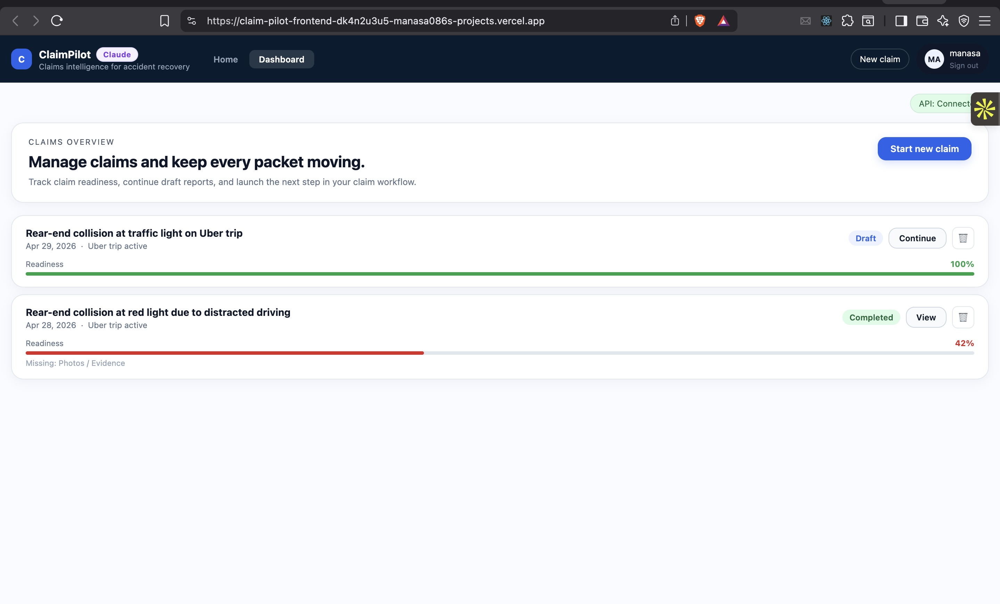
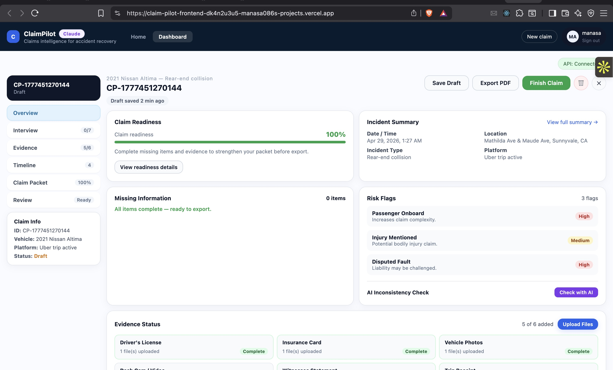
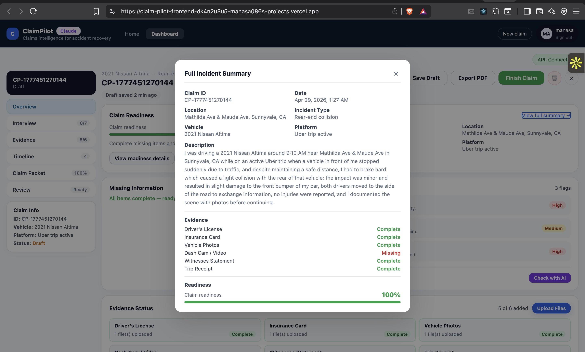

# ClaimPilot

AI-powered claim documentation assistant for rideshare and delivery drivers. Guides users through every step of documenting a vehicle incident — from plain-English description to a print-ready PDF packet.

**Live app:** https://claimpilot.vercel.app  
**Backend API:** https://claimpilot-wvhi.onrender.com

---

## Screenshots

**Claims Dashboard** — live readiness scores for all claims at a glance



**Individual Claim Overview** — readiness, missing items, evidence status, and AI risk flags



**Full Incident Summary** — complete structured record with description, evidence checklist, and readiness score



---

## Architecture

```
┌─────────────────────────────────────────────────────────────┐
│                        Browser                              │
│          React + TypeScript (Vite)  — Vercel CDN            │
│                                                             │
│  Tabs: Home │ Login │ Dashboard (Demo when logged out)      │
└──────────────────────┬──────────────────────────────────────┘
                       │ HTTPS  (VITE_API_BASE_URL)
┌──────────────────────▼──────────────────────────────────────┐
│                    Backend API                              │
│          Node.js + Express + TypeScript  — Render           │
│                                                             │
│  /api/auth               — login / verify / logout          │
│  /api/auth/signup-request — request access (+ email admin)  │
│  /api/auth/:id/approve   — approve user (+ mailto button)   │
│  /api/auth/:id/reject    — reject request                   │
│  /api/reports            — authenticated CRUD (per-user)    │
│  /api/demo/reports       — public read-only (dummy table)   │
│  /api/ai                 — AI autofill, narrative, photo scan│
└──────┬──────────────────────────────┬───────────────────────┘
       │ pg (DATABASE_URL)            │ Anthropic SDK + Resend
┌──────▼──────────────┐     ┌─────────▼──────────┐
│     Supabase        │     │  External Services  │
│   PostgreSQL        │     │                     │
│                     │     │  Claude API         │
│  incident_reports   │     │  (claude-opus-4-7)  │
│  incident_reports   │     │                     │
│    _dummy           │     │  Resend             │
│  users              │     │  (email via HTTPS)  │
│  sessions           │     └─────────────────────┘
│  signup_requests    │
│                     │
│  Supabase Storage   │
│  (claim-photos)     │
└─────────────────────┘
```

### Key design decisions

| Decision | Reason |
|---|---|
| Per-user data isolation via `user_id` | Each user only sees their own claims; filtered on every DB query |
| `signup_requests` table + admin email flow | Self-serve access requests — admin approves/rejects via email links |
| Resend over SMTP (nodemailer) | Cloud platforms (Railway, Render) block outbound SMTP ports; Resend uses HTTPS |
| `incident_reports_dummy` separate table | Public demo data is isolated — live claims never exposed unauthenticated |
| Supabase Storage for photos | Signed URLs with long TTL survive server restarts; base64 sent to Claude for AI analysis |
| `AI_PROVIDER` env var | Swap between Claude and OpenAI without code changes |
| Docker Compose override file for local postgres | One command switches between Supabase and local DB |
| `requireAuth` middleware on `/api/reports` | Session validated on every request; `user_id` injected from session |

---

## User access flow

1. New user visits the app → clicks **Request access** on the Login page
2. Fills in email, password, and reason → submitted to `signup_requests` table
3. Admin receives an email (via Resend) with **Approve** / **Reject** buttons
4. **Approve** → user added to `users` table, admin gets a mailto button to notify user
5. **Reject** → request marked rejected, record retained in DB
6. User can now sign in with their email + password

---

## Running locally

### Prerequisites
- [Docker Desktop](https://www.docker.com/products/docker-desktop/) installed and running
- `.env` file in the project root (copy the values from the team vault or ask Manasa)

### Option A — Supabase (cloud database, recommended)

```bash
git clone https://github.com/manasa086/ClaimPilot.git
cd ClaimPilot
docker-compose up --build
```

App is at **http://localhost:5173**

### Option B — Local PostgreSQL (fully offline)

```bash
docker-compose -f docker-compose.yml -f docker-compose.local.yml up --build
```

- Starts a `postgres:16` container automatically
- `docker/init.sql` creates all tables on first boot
- Login uses `AUTH_USERNAME` / `AUTH_PASSWORD` from `.env` (env-var fallback)

To reset the local database:
```bash
docker-compose down -v
docker-compose -f docker-compose.yml -f docker-compose.local.yml up --build
```

### Stopping

```bash
docker-compose down        # stop, keep data
docker-compose down -v     # stop and wipe local postgres
```

---

## Environment variables

All variables live in `.env` at the project root.

| Variable | Used by | Purpose |
|---|---|---|
| `VITE_API_BASE_URL` | Frontend | Backend URL (`http://localhost:3001` locally) |
| `VITE_SUPABASE_URL` | Frontend | Supabase project URL (photo uploads) |
| `VITE_SUPABASE_ANON_KEY` | Frontend | Supabase anon key |
| `VITE_AI_PROVIDER` | Frontend | Badge display (`claude` or `openai`) |
| `AI_PROVIDER` | Backend | Which AI client to use |
| `ANTHROPIC_API_KEY` | Backend | Claude API key |
| `OPENAI_API_KEY` | Backend | OpenAI API key (if using OpenAI) |
| `DATABASE_URL` | Backend | PostgreSQL connection string |
| `SUPABASE_SERVICE_ROLE_KEY` | Backend | Supabase service role (storage ops) |
| `AUTH_USERNAME` | Backend | Fallback login username (local dev) |
| `AUTH_PASSWORD` | Backend | Fallback login password (local dev) |
| `FRONTEND_URL` | Backend | Allowed CORS origin |
| `BACKEND_URL` | Backend | Public backend URL (used in email approve/reject links) |
| `RESEND_API_KEY` | Backend | Resend API key for email sending |
| `ADMIN_EMAIL` | Backend | Email address that receives access request notifications |

---

## Project structure

```
ClaimPilot/
├── frontend/               # Vite + React + TypeScript
│   └── src/
│       ├── pages/          # LandingPage, LoginPage (with signup modal)
│       ├── components/     # AppShell, ReportDashboard, ReportsHome, …
│       └── utils/          # auth.ts, apiFetch.ts, ai.ts, supabase.ts
├── backend/                # Node.js + Express + TypeScript
│   └── src/
│       ├── routes/         # auth, reports, demo, ai, health
│       ├── middleware/     # requireAuth.ts (session validation)
│       └── services/       # claudeClient, openaiClient, aiProvider, emailService
├── docker/
│   └── init.sql            # Schema for local PostgreSQL (all tables)
├── docker-compose.yml          # Default (Supabase)
├── docker-compose.local.yml    # Override for local PostgreSQL
├── dev-cloud.sh                # Shortcut: docker-compose up (Supabase)
└── dev-local.sh                # Shortcut: docker-compose local up
```

---

## Database schema

| Table | Purpose |
|---|---|
| `users` | Authorized users — username + bcrypt password hash |
| `sessions` | Active login sessions with expiry |
| `signup_requests` | Access requests from the login page (pending / approved / rejected) |
| `incident_reports` | Live claim data — scoped per `user_id` |
| `incident_reports_dummy` | Read-only demo data — public, never written to by the app |

---

## Deployment

| Service | Platform | Notes |
|---|---|---|
| Frontend | Vercel | Auto-deploys on `git push` to main |
| Backend | Render | Dockerfile-based, auto-deploys on push; free tier spins down after 15 min idle |
| Database | Supabase | Managed PostgreSQL + Storage |
| Email | Resend | HTTP-based (no SMTP); free tier 3,000 emails/month |

### Adding a new env var
1. Add to `.env` locally
2. Add to Render → Environment (backend vars)
3. Add to Vercel → Settings → Environment Variables (`VITE_` prefix vars only)
4. Redeploy both services

### Managing user access
- **Grant access:** approve via email link → user added to `users` table
- **Revoke access:** run in Supabase SQL Editor:
```sql
DELETE FROM users WHERE LOWER(username) = 'user@email.com';
DELETE FROM sessions WHERE user_name = 'user@email.com';
DELETE FROM incident_reports WHERE user_id = 'user@email.com';
```
